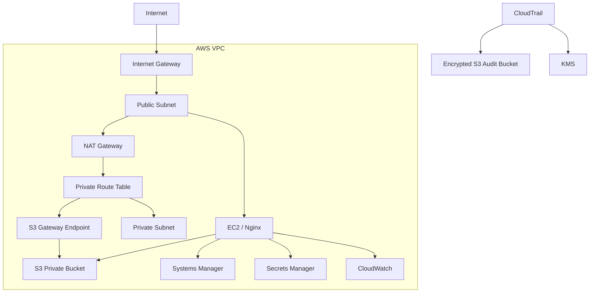

# Terraform AWS Cloud Security Lab

AWS infrastructure lab built with Terraform to demonstrate secure cloud architecture, Infrastructure as Code, least-privilege IAM, encryption, auditing, and observability.


## Architecture



## Security Controls

| Control | Implementation |
|---|---|
| Infrastructure as Code | AWS infrastructure managed with Terraform |
| Administrative access | AWS Systems Manager instead of public SSH |
| Least privilege | EC2 IAM permissions scoped to required AWS resources |
| S3 protection | Block Public Access and SSE-KMS encryption |
| Secrets | Application secret stored in AWS Secrets Manager |
| Encryption | Dedicated KMS keys for protected resources |
| Private AWS access | S3 Gateway VPC Endpoint |
| API auditing | CloudTrail with encrypted S3 log storage |
| Monitoring | CloudWatch metrics, logs, and alarms |
| Remote state | Terraform state stored in an encrypted S3 backend |

## Infrastructure

Terraform manages:

- VPC with public and private network segmentation
- Internet Gateway, NAT Gateway, and route tables
- Amazon EC2 running Nginx
- Security Groups
- IAM roles and least-privilege policies
- Amazon S3 with KMS encryption
- AWS Systems Manager
- AWS Secrets Manager
- S3 Gateway VPC Endpoint
- AWS CloudTrail
- Amazon CloudWatch
- Remote Terraform state

## IAM Design

The EC2 workload uses an IAM Role instead of long-term credentials.

Permissions are scoped to required resources, including:

- `s3:GetObject` for the application bucket
- `kms:Decrypt` for encrypted resources
- `ssm:GetParameter` for required parameters
- `secretsmanager:GetSecretValue` for the application secret

Administrative access is handled through Systems Manager, removing the need to expose SSH to the Internet.

## Observability

The infrastructure includes CloudWatch monitoring for EC2 and application logs.

```text
Nginx
  |
  v
/var/log/nginx/error.log
  |
  v
CloudWatch Agent
  |
  v
CloudWatch Logs
  |
  v
Metric Filter
  |
  v
NginxErrorCount
  |
  v
CloudWatch Alarm
```

The CloudWatch Agent configuration is stored in SSM Parameter Store and retrieved by the EC2 instance during bootstrap.

## Validation

The Terraform configuration is checked locally with:

```bash
terraform fmt -check
terraform validate
git diff --check
```

Security and configuration changes are reviewed through Git branches and pull requests before being merged.

> The latest observability changes have been validated statically with Terraform. Runtime deployment validation is pending.

## Project Structure

```text
.
├── backend.tf
├── cloudtrail.tf
├── cloudwatch.tf
├── ec2.tf
├── endpoints.tf
├── iam.tf
├── main.tf
├── outputs.tf
├── parameters.tf
├── s3.tf
├── secrets.tf
├── security.tf
└── variables.tf
```

## Technologies

**Cloud:** AWS  
**IaC:** Terraform  
**Security:** IAM, KMS, Secrets Manager, Systems Manager  
**Networking:** VPC, Subnets, NAT Gateway, VPC Endpoint  
**Monitoring:** CloudWatch, CloudTrail  
**Systems:** Amazon Linux, Nginx  
**Workflow:** Git, GitHub
